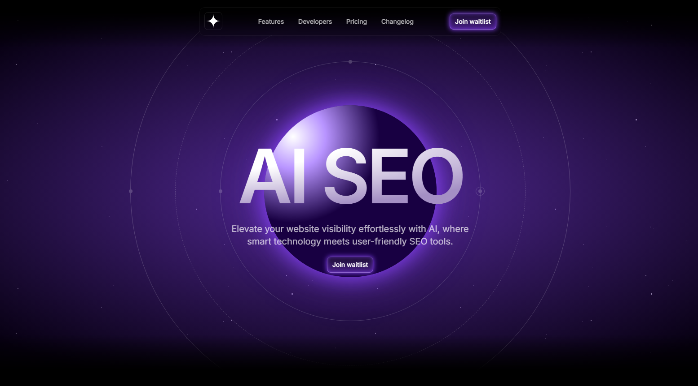

# Nova 🌌

**Nova** is a high-performance, space-inspired landing page for an AI-powered SEO startup. Built with **Next.js 14**, **TypeScript**, and **Framer Motion**, it combines futuristic aesthetics with production-ready architecture. The platform is designed to help businesses automate their search engine optimization through smart keyword generation and one-click site audits.

---

## ✨ Features

- **Futuristic Space UI:** A visually stunning hero section featuring animated starry backgrounds and a glowing central planet with orbital rings.
- **AI-Powered Tools:**
  - **Smart Keyword Generator:** An AI engine that identifies high-impact keywords (marked as "New").
  - **One-Click Optimization:** Instant SEO fixes for modern websites.
  - **User-Friendly Dashboard:** A clean, data-driven interface for tracking visibility.
- **Engaging Animations:** Smooth scroll reveals and Lottie-powered icons for an interactive user experience.
- **Social Proof:** Integrated logo ticker for partners and a testimonial grid featuring CTOs and Founders.
- **Conversion Focused:** Optimized sticky navigation with a prominent "Join Waitlist" CTA.

---

## 🛠 Tech Stack

- **Framework:** [Next.js 14](https://nextjs.org/) (App Router)
- **Language:** [TypeScript](https://www.typescriptlang.org/)
- **Styling:** [Tailwind CSS](https://tailwindcss.com/)
- **Animations:** [Framer Motion](https://www.framer.com/motion/) & [Lottie React](https://github.com/LottieFiles/lottie-react)
- **Design:** Dark Theme with custom Purple Accents (`rgb(140,69,255)`)

---

## ⚙️ Getting Started
